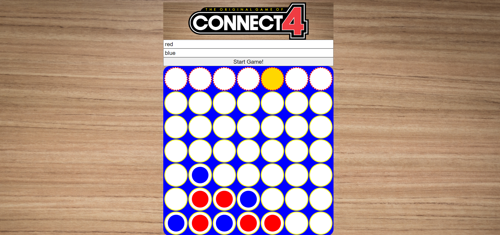

# The Connect Four Game

## Description 

This is the classic game that everyone played growing up that I created with JavaScript! Built with Object Oriented Programming.

### **Directions for Play:** 

Player 1 and Player 2 get to choose which color they would like to play with, and click on the top row for their where they want their pieces to fall.
